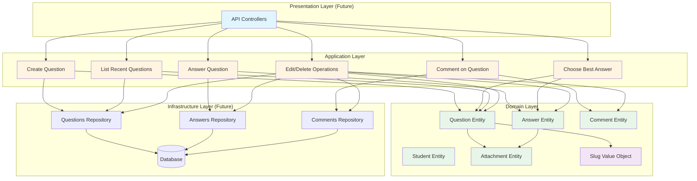
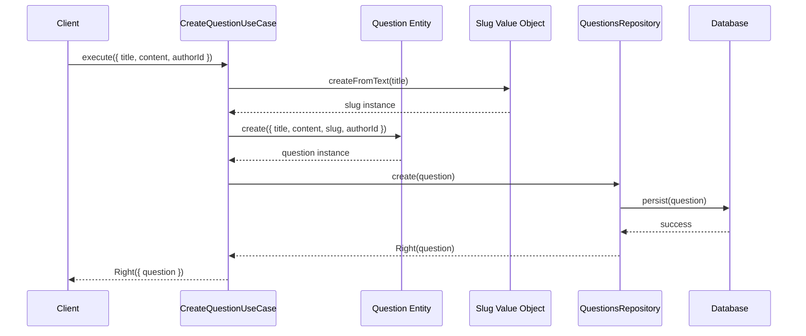
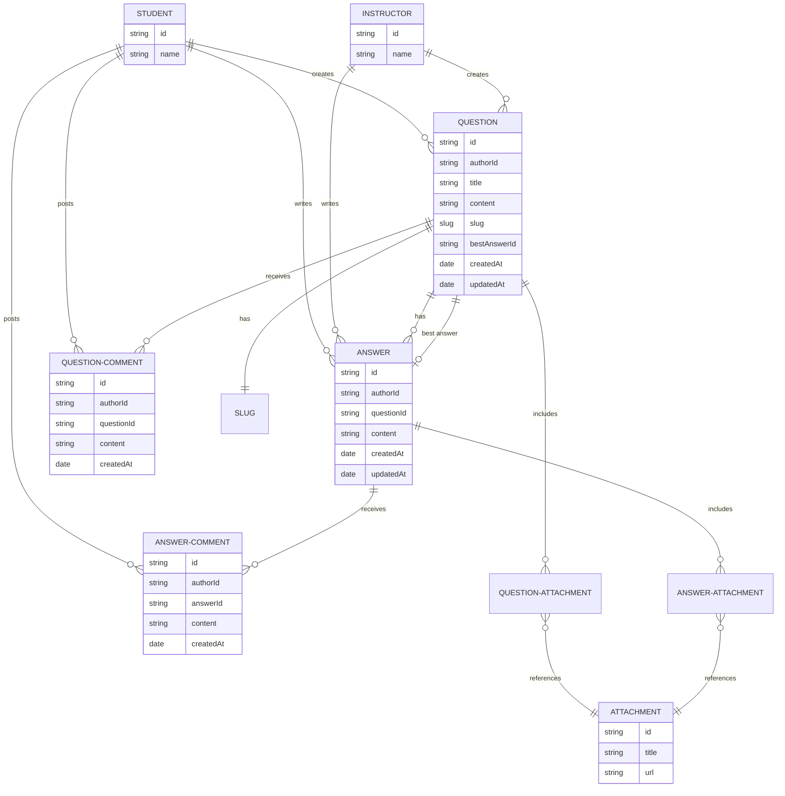

# Forum API

A robust and scalable forum API built with TypeScript, implementing Domain-Driven Design (DDD) principles and Clean Architecture patterns.

## 📋 Overview

This project is a backend API for a forum application that enables users to create questions, post answers, add comments, and interact with content. The architecture follows DDD principles with clear separation between domain entities, application use cases, and infrastructure concerns.

## ✨ Features

### Questions
- Create new questions with title, content, and attachments
- Edit existing questions
- Delete questions
- Get question by slug
- List recent questions
- Choose best answer for a question
- Auto-generate URL-friendly slugs from titles

### Answers
- Post answers to questions
- Edit existing answers
- Delete answers
- List answers for a specific question

### Comments
- Comment on questions
- Comment on answers
- List comments for questions
- List comments for answers
- Delete question comments
- Delete answer comments

## 🏗️ Architecture

The project follows **Clean Architecture** and **Domain-Driven Design** principles:

```
src/
├── core/                    # Core building blocks
│   ├── entities/           # Base entity classes
│   ├── repositories/       # Repository interfaces
│   ├── types/              # Common types
│   └── either.ts           # Functional error handling
│
├── domain/                  # Business logic layer
│   └── forum/
│       ├── enterprise/      # Domain entities
│       │   └── entities/   # Question, Answer, Comment, etc.
│       └── application/     # Application layer
│           ├── use-cases/  # Business use cases
│           └── repositories/ # Repository contracts
│
└── test/                    # Test utilities
    ├── factories/          # Test data factories
    └── repositories/       # In-memory repositories
```

### Key Design Patterns

- **Entity Pattern**: Core domain entities with rich business logic
- **Repository Pattern**: Abstract data access with interface-based contracts
- **Use Case Pattern**: Encapsulated business operations
- **Value Objects**: Immutable domain concepts (e.g., Slug)
- **Aggregate Root**: Consistency boundaries for related entities
- **Either Pattern**: Functional error handling without exceptions

### Architecture Flow



### Use Case Flow Example



## 🚀 Getting Started

### Prerequisites

- Node.js 22+
- pnpm (or npm/yarn)

### Installation

```bash
# Install dependencies
pnpm install
```

### Running Tests

```bash
# Run all tests
pnpm test

# Run tests in watch mode
pnpm test --watch

# Run tests with coverage
pnpm test --coverage
```

## 🛠️ Tech Stack

- **TypeScript**: Type-safe development
- **Vitest**: Fast unit testing framework
- **Day.js**: Lightweight date manipulation
- **Biome**: Fast linting and formatting
- **Faker.js**: Generate test data

## 📦 Project Structure

### Domain Model Relationships



### Core Entities

- **Question**: Forum questions with title, content, slug, and attachments
- **Answer**: Responses to questions
- **QuestionComment**: Comments on questions
- **AnswerComment**: Comments on answers
- **Student**: Users who ask questions and post answers
- **Instructor**: Users with elevated privileges
- **Attachment**: File attachments for questions and answers

### Use Cases

All business operations are implemented as isolated use cases:

- `CreateQuestion`
- `EditQuestion`
- `DeleteQuestion`
- `GetQuestionBySlug`
- `ListRecentQuestions`
- `AnswerQuestion`
- `EditAnswer`
- `DeleteAnswer`
- `ChooseQuestionBestAnswer`
- `CommentOnQuestion`
- `CommentOnAnswer`
- `ListQuestionComments`
- `ListAnswerComments`
- `DeleteQuestionComment`
- `DeleteAnswerComment`

## 🧪 Testing

The project uses **Vitest** for testing with:

- In-memory repositories for isolated unit tests
- Factory functions for test data generation
- Comprehensive test coverage for all use cases

Example test structure:

```typescript
import { InMemoryQuestionsRepository } from 'test/repositories/in-memory-questions-repositories'
import { makeQuestion } from 'test/factories/make-question'
import { CreateQuestionUseCase } from './create-question'

describe('CreateQuestionUseCase', () => {
  it('should create a new question', async () => {
    const repository = new InMemoryQuestionsRepository()
    const useCase = new CreateQuestionUseCase(repository)
    
    const result = await useCase.execute({
      authorId: 'author-1',
      title: 'New Question',
      content: 'Question content'
    })
    
    expect(result.isRight()).toBe(true)
  })
})
```

## 🔧 Configuration

### TypeScript

The project uses modern TypeScript configuration with:
- ES2024 features
- Path aliases (`@/*` → `./src/*`)
- Strict type checking
- Node.js module resolution

### Path Aliases

Import from `src/` using the `@/` alias:

```typescript
import { Entity } from '@/core/entities/entity'
import { Question } from '@/domain/forum/enterprise/entities/question'
```

## 📝 Development Guidelines

### Domain-Driven Design

- Keep business logic in domain entities
- Use value objects for concepts without identity
- Implement use cases for application operations
- Define repository interfaces in the domain layer
- Maintain clear bounded contexts

### Code Quality

- Write tests for all use cases
- Follow SOLID principles
- Use TypeScript strict mode
- Maintain separation of concerns
- Document complex business rules

## 📄 License

ISC

## 👤 Author

Mariano

---

Built with ❤️ using TypeScript and Clean Architecture principles
